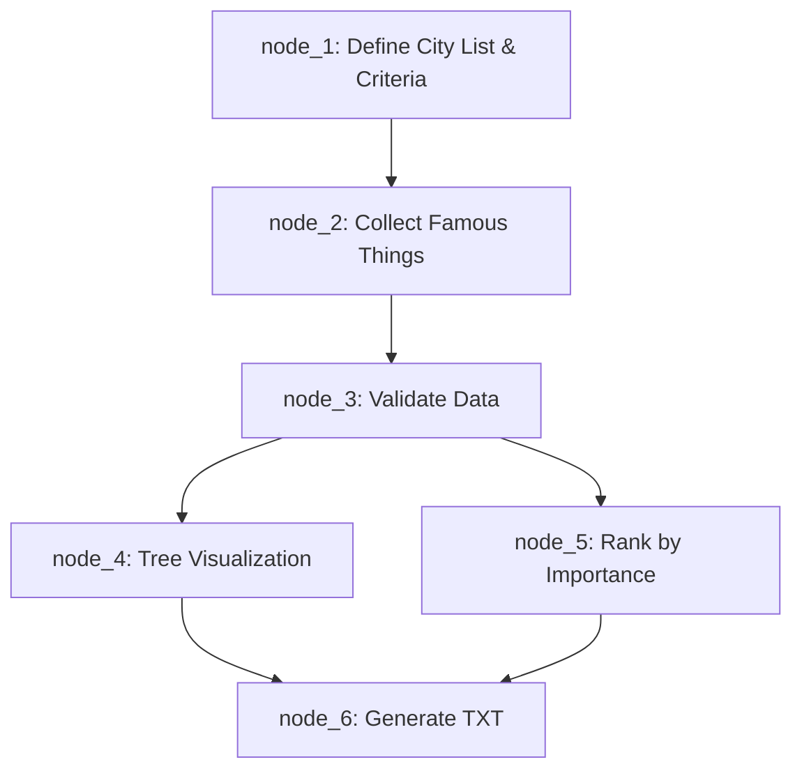

# Verifiable Task Graph Plan

## Task: 搜寻世界上前10城市的10个出名的事物共100个，用树结构可视化展现出来，同时对这100个的重要性排序，排序结果生成txt文件

---

## Mermaid Flowchart

---

## Node Details

### node_1: Define City List & Criteria

| Field | Value |
|-------|-------|
| **Input** | none |
| **Output** | `{ "cities": ["Paris","Tokyo","New York","London","Rome","Beijing","Istanbul","Barcelona","Sydney","Dubai"], "criteria": "Global recognition, cultural significance, tourism popularity, historical importance" }` |
| **Gate Condition** | 10 unique cities returned |
| **Necessity Claim** | Without defining the city list, there is no basis for data collection. This node establishes the foundational scope. |
| **Necessity Audit** | If removed, node_2 has no city inputs → data collection impossible. **Verdict: indispensable** |
| **Verification Rule** | Output contains exactly 10 unique city names as strings, criteria is a non-empty string. |
| **Input Example** | `{}` |
| **Output Example** | `{"cities":["Paris","Tokyo","New York","London","Rome","Beijing","Istanbul","Barcelona","Sydney","Dubai"],"criteria":"Global recognition, cultural significance, tourism popularity, historical importance"}` |
| **Evidence Pointers** | `["log/task_1_attempt1.md"]` |

---

### node_2: Collect Famous Things

| Field | Value |
|-------|-------|
| **Input** | `cities_list` from node_1 |
| **Output** | `{ "data": [{"city":"Paris","things":["Eiffel Tower","Louvre Museum","Notre-Dame","Arc de Triomphe","Champs-Élysées","Palace of Versailles","Musée d'Orsay","Montmartre","Seine River Cruise","Moulin Rouge"]}, ...] }` (10 cities × 10 things = 100 items) |
| **Gate Condition** | 100 items total, 10 per city |
| **Necessity Claim** | This is the core data collection — the 100 famous things that form the entire dataset. |
| **Necessity Audit** | If removed, there is no data to visualize or rank. **Verdict: indispensable** |
| **Verification Rule** | Output JSON has exactly 10 cities, each with exactly 10 string entries, total 100 unique items. |
| **Input Example** | `{"cities":["Paris","Tokyo","New York","London","Rome","Beijing","Istanbul","Barcelona","Sydney","Dubai"],"criteria":"..."}` |
| **Output Example** | `{"data":[{"city":"Paris","things":["Eiffel Tower","Louvre Museum","Notre-Dame","Arc de Triomphe","Champs-Élysées","Palace of Versailles","Musée d'Orsay","Montmartre","Seine River Cruise","Moulin Rouge"]},{"city":"Tokyo","things":["Tokyo Tower","Shibuya Crossing","Meiji Shrine","Senso-ji Temple","Mount Fuji (nearby)","Imperial Palace","Akihabara","Shinjuku Gyoen","Tsukiji Outer Market","Robot Restaurant"]}]}` |
| **Evidence Pointers** | `["log/task_2_attempt1.md"]` |

---

### node_3: Validate Data

| Field | Value |
|-------|-------|
| **Input** | raw_data from node_2 |
| **Output** | `{ "validated_data": <same structure>, "validation_status": true, "total_items": 100, "cities_count": 10, "items_per_city": 10, "duplicates_found": 0 }` |
| **Gate Condition** | validation_status == true |
| **Necessity Claim** | Ensures data quality before downstream processing. Prevents tree viz and ranking from operating on bad data. |
| **Necessity Audit** | If removed, malformed data could propagate to node_4/node_5 causing invalid visualizations and rankings. **Verdict: indispensable** |
| **Verification Rule** | validation_status is boolean true, total_items == 100, no duplicates, all cities have 10 items. |
| **Input Example** | raw_data from node_2 output_example |
| **Output Example** | `{"validated_data":"<passed through>","validation_status":true,"total_items":100,"cities_count":10,"items_per_city":10,"duplicates_found":0}` |
| **Evidence Pointers** | `["log/task_3_attempt1.md"]` |

---

### node_4: Tree Visualization

| Field | Value |
|-------|-------|
| **Input** | validated_data from node_3 |
| **Output** | `{ "tree": "🌍 World's Famous Things\\n├── 🇫🇷 Paris\\n│   ├── Eiffel Tower\\n│   ├── Louvre Museum\\n│   ...\\n├── 🇯🇵 Tokyo\\n│   ├── Tokyo Tower\\n│   ...\\n" }` |
| **Gate Condition** | tree string is non-empty, contains all 10 cities and 100 items |
| **Necessity Claim** | Visualizes the hierarchical relationship between cities and their famous things in an intuitive tree format. |
| **Necessity Audit** | If removed, the output lacks the required tree visualization. **Verdict: indispensable** |
| **Verification Rule** | Tree string contains all 10 city names, contains 100 item entries, uses tree characters (├──, └──, │). |
| **Input Example** | validated_data from node_3 |
| **Output Example** | `{"tree":"🌍 World's Famous Things\n├── 🇫🇷 Paris\n│   ├── 1. Eiffel Tower\n..."}` |
| **Evidence Pointers** | `["log/task_4_attempt1.md"]` |

---

### node_5: Rank by Importance

| Field | Value |
|-------|-------|
| **Input** | validated_data from node_3 |
| **Output** | `{ "ranked_list": [{"rank":1,"item":"Great Wall of China","city":"Beijing","score":100}, {"rank":2,"item":"Eiffel Tower","city":"Paris","score":99}, ...] }` — 100 items with unique ranks |
| **Gate Condition** | 100 unique ranks, 1 to 100 |
| **Necessity Claim** | Assigns importance ranking to all 100 items based on global cultural significance, historical impact, and tourism value. |
| **Necessity Audit** | If removed, no ranking exists — the TXT file would lack the required importance ordering. **Verdict: indispensable** |
| **Verification Rule** | Output has exactly 100 items, ranks 1-100 with no gaps or duplicates, each has item/city/rank fields. |
| **Input Example** | validated_data from node_3 |
| **Output Example** | `{"ranked_list":[{"rank":1,"item":"Great Wall of China","city":"Beijing","score":100},{"rank":2,"item":"Eiffel Tower","city":"Paris","score":99}]}` |
| **Evidence Pointers** | `["log/task_5_attempt1.md"]` |

---

### node_6: Generate TXT

| Field | Value |
|-------|-------|
| **Input** | ranked_list from node_5, tree_visualization from node_4 |
| **Output** | `{ "txt_content": "=== World's Top 100 Famous Things ===\n\n--- TREE STRUCTURE ---\n🌍 ...\n\n--- IMPORTANCE RANKING ---\nRank 1: Great Wall of China (Beijing)\nRank 2: Eiffel Tower (Paris)\n...\n" }` |
| **Gate Condition** | txt_content is non-empty, contains tree + ranking |
| **Necessity Claim** | Merges tree visualization and ranking into the final deliverable TXT file content. |
| **Necessity Audit** | If removed, no final output file is produced — the entire workflow has no deliverable. **Verdict: indispensable** |
| **Verification Rule** | txt_content contains tree section, ranking section, all 100 items appear in ranking section. |
| **Input Example** | ranked_list + tree from upstream |
| **Output Example** | `{"txt_content":"=== World's Top 100 Famous Things ===\n\n--- TREE STRUCTURE ---\n...\n\n--- IMPORTANCE RANKING ---\n1. Great Wall of China (Beijing)\n..."}` |
| **Evidence Pointers** | `["log/task_6_attempt1.md"]` |

---

## Edges Summary

| From | To | Type |
|------|----|------|
| node_1 | node_2 | data dependency (cities_list) |
| node_2 | node_3 | data dependency (raw_data) |
| node_3 | node_4 | data dependency (validated_data) |
| node_3 | node_5 | data dependency (validated_data) |
| node_4 | node_6 | data dependency (tree_visualization) |
| node_5 | node_6 | data dependency (ranked_list) |
