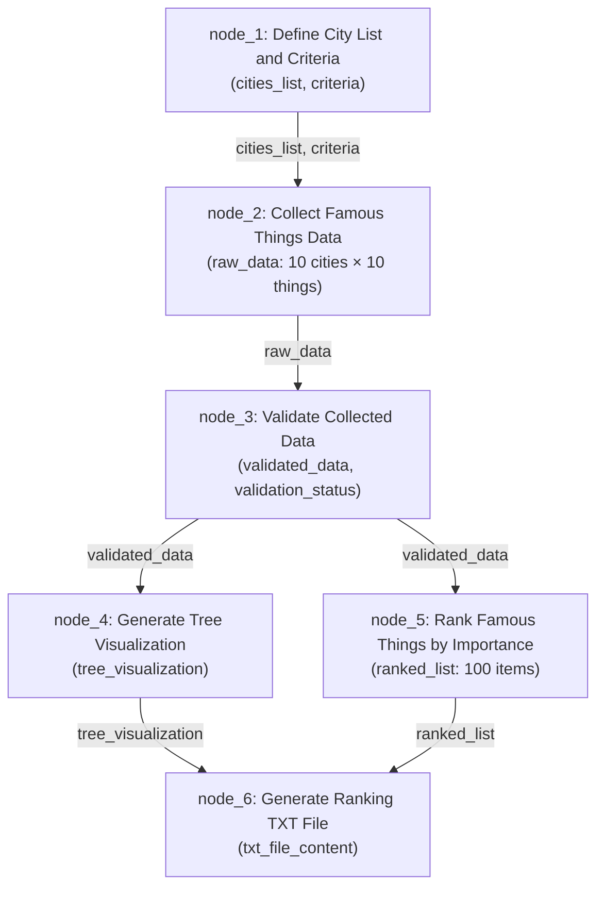

# Verifiable Task Graph Plan: City Famous Things

## Task Goal
Collect 10 famous things for each of the world's top 10 cities (100 items total), visualize as a tree structure, rank all 100 by importance, and generate a TXT file with the ranking.

---

## Mermaid Flowchart

---

## Per-Node Details

---

### node_1: Define City List and Criteria

| Field | Value |
|-------|-------|
| **Input Spec** | None (root node) |
| **Output Spec** | `cities_list`: array of 10 unique strings; `criteria`: object with `famous_things_type` (string) and `importance_factors` (array of strings) |
| **Input Example** | N/A |
| **Output Example** | `cities_list`: ["Tokyo", "New York", "London", "Paris", "Singapore", "Dubai", "Shanghai", "Sydney", "Barcelona", "Istanbul"]; `criteria`: {"famous_things_type": "landmarks, cultural sites, food, events, architecture", "importance_factors": ["global_recognition", "tourist_visitors", "cultural_significance", "historical_importance", "uniqueness"]} |
| **Necessity Claim** | Without a consistent city list and criteria, all downstream nodes would use different city sets, making the final output incoherent. |
| **Necessity Audit** | If removed: node_2 has no cities to query — entire pipeline produces nothing. **Verdict: indispensable** |
| **Verification Rule** | `cities_list` must have exactly 10 unique entries, all well-known global cities; `criteria` must have both `famous_things_type` and `importance_factors` fields. |
| **Gate Condition** | `cities_list` has exactly 10 unique entries AND `criteria` has required fields |
| **Evidence Pointers** | `modules/node_1/memory.md#actual_output`, `log/task_1_attempt1.md#llm_response` |

---

### node_2: Collect Famous Things Data

| Field | Value |
|-------|-------|
| **Input Spec** | `cities_list`: array of 10 strings; `criteria`: object |
| **Output Spec** | `raw_data`: array of 10 objects, each with `city` (string) and `things` (array of exactly 10 strings) |
| **Input Example** | `cities_list`: ["Tokyo", "New York", ...]; `criteria`: {"famous_things_type": "landmarks, cultural sites, ..."} |
| **Output Example** | `raw_data`: [{"city": "Tokyo", "things": ["Tokyo Tower", "Shibuya Crossing", "Senso-ji Temple", "Tsukiji Fish Market", "Meiji Shrine", "Tokyo Skytree", "Akihabara", "Imperial Palace", "Harajuku", "Shinjuku Gyoen"]}, {"city": "New York", "things": ["Statue of Liberty", "Central Park", ...]}, ...] |
| **Necessity Claim** | Sole data source for the entire graph — without it, there's nothing to rank or visualize. |
| **Necessity Audit** | If removed: node_3 has no data to validate, node_4 and node_5 produce nothing, node_6 has no content. **Verdict: indispensable** |
| **Verification Rule** | Exactly 10 city objects, each with exactly 10 things, no duplicates within a city, all non-empty strings. |
| **Gate Condition** | `raw_data` has length 10 AND each city's `things` array has length 10 |
| **Evidence Pointers** | `modules/node_2/memory.md#actual_output`, `log/task_2_attempt1.md#llm_response` |

---

### node_3: Validate Collected Data

| Field | Value |
|-------|-------|
| **Input Spec** | `raw_data`: array of 10 objects |
| **Output Spec** | `validated_data`: same structure as `raw_data`; `validation_status`: boolean |
| **Input Example** | `raw_data`: [{"city": "Tokyo", "things": [...10 items...]}, ...] |
| **Output Example** | `validated_data`: (same as raw_data); `validation_status`: true |
| **Necessity Claim** | The only integrity checkpoint — without it, missing items or duplicates propagate silently to visualization and ranking. |
| **Necessity Audit** | If removed: node_4 and node_5 receive unchecked data; a city with only 8 things or a duplicate silently corrupts the final output. **Verdict: indispensable** |
| **Verification Rule** | City count = 10, things per city = 10, all non-empty strings, no duplicates within a city, total items = 100. |
| **Gate Condition** | `validation_status` must be `true` |
| **Evidence Pointers** | `modules/node_3/memory.md#actual_output`, `log/task_3_attempt1.md#llm_response` |

---

### node_4: Generate Tree Visualization

| Field | Value |
|-------|-------|
| **Input Spec** | `validated_data`: array of 10 objects with `city` and `things` fields |
| **Output Spec** | `tree_visualization`: string with hierarchical city → items format |
| **Input Example** | `validated_data`: [{"city": "Tokyo", "things": ["Tokyo Tower", ...]}, ...] |
| **Output Example** | `tree_visualization`: "World Top 10 Cities — Famous Things\n├── Tokyo\n│   ├── Tokyo Tower\n│   ├── Shibuya Crossing\n│   ...\n├── New York\n│   ├── Statue of Liberty\n│   ...\n..." |
| **Necessity Claim** | Sole provider of the tree visualization artifact required by the task description. |
| **Necessity Audit** | If removed: node_6 produces a TXT with only a ranking list but no tree — task requirement unmet. **Verdict: indispensable** |
| **Verification Rule** | Non-empty string containing all 10 city names as headers and all 100 items listed hierarchically. |
| **Gate Condition** | `tree_visualization` is a non-empty string containing at least 10 city headers |
| **Evidence Pointers** | `modules/node_4/memory.md#actual_output`, `log/task_4_attempt1.md#llm_response` |

---

### node_5: Rank Famous Things by Importance

| Field | Value |
|-------|-------|
| **Input Spec** | `validated_data`: array of 10 objects with `city` and `things` fields |
| **Output Spec** | `ranked_list`: array of 100 objects, each with `rank` (int 1-100), `item` (string), `city` (string) |
| **Input Example** | `validated_data`: [{"city": "Tokyo", "things": [...]}] |
| **Output Example** | `ranked_list`: [{"rank": 1, "item": "Eiffel Tower", "city": "Paris"}, {"rank": 2, "item": "Statue of Liberty", "city": "New York"}, ... {"rank": 100, "item": "Shinjuku Gyoen", "city": "Tokyo"}] |
| **Necessity Claim** | Sole provider of the ranked list — without it, the TXT file has no ranking content. |
| **Necessity Audit** | If removed: node_6 has no ranked_list to include; the deliverable TXT only contains the tree but no ranking. **Verdict: indispensable** |
| **Verification Rule** | Exactly 100 items; ranks 1 through 100 unique; sorted ascending by rank; all items have `rank`, `item`, and `city` fields; no duplicates. |
| **Gate Condition** | `ranked_list` has length 100 AND ranks are unique 1-100 |
| **Evidence Pointers** | `modules/node_5/memory.md#actual_output`, `log/task_5_attempt1.md#llm_response` |

---

### node_6: Generate Ranking TXT File

| Field | Value |
|-------|-------|
| **Input Spec** | `ranked_list`: array of 100 objects; `tree_visualization`: string |
| **Output Spec** | `txt_file_content`: string combining ranking + tree visualization |
| **Input Example** | `ranked_list`: [{rank:1, ...}, ...]; `tree_visualization`: "World Top 10 Cities..." |
| **Output Example** | `txt_file_content`: "=== WORLD TOP 10 CITIES: FAMOUS THINGS RANKING ===\n\nRank 1: Eiffel Tower (Paris)\nRank 2: Statue of Liberty (New York)\n...\n\n=== TREE VISUALIZATION ===\n\n├── Tokyo\n│   ├── ...\n..." |
| **Necessity Claim** | Sole producer of the final deliverable format required by the task. |
| **Necessity Audit** | If removed: ranking and tree exist in memory but are never combined into the required TXT file. **Verdict: indispensable** |
| **Verification Rule** | Non-empty string containing both a ranked list of 100 items and the tree visualization. |
| **Gate Condition** | `txt_file_content` is non-empty and contains both "Rank" entries and city tree structure |
| **Evidence Pointers** | `modules/node_6/memory.md#actual_output`, `log/task_6_attempt1.md#llm_response`, `example/example1/result.txt` |

---

## Edge Summary

| From | To | Data Passed |
|------|----|-------------|
| node_1 | node_2 | `cities_list`, `criteria` |
| node_2 | node_3 | `raw_data` |
| node_3 | node_4 | `validated_data` |
| node_3 | node_5 | `validated_data` |
| node_4 | node_6 | `tree_visualization` |
| node_5 | node_6 | `ranked_list` |

---

## Pruning Analysis

All 6 nodes have been verified as **indispensable** via counterfactual audit. No nodes can be removed without breaking the task goal.

---

*Please review this plan and approve to proceed with execution.*
