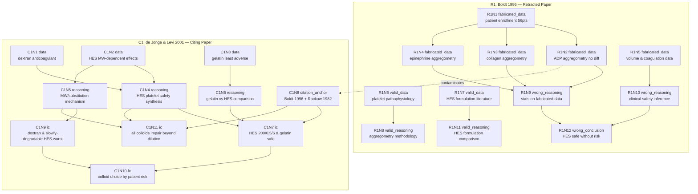

# Verifiable Task Graph Plan

## Task
分析撤稿论文 Boldt et al. 1996 (R1) 及其引用论文 de Jonge & Levi 2001 (C1) 的污染传播关系。

## 命名规范
- 撤稿论文节点：`R1N1`, `R1N2`, ... (Retracted Paper 1, Node N)
- 引用论文节点：`C1N1`, `C1N2`, ... (Citing Paper 1, Node N)
- 撤稿论文边：`R1E1-2` (Edge from R1N1 to R1N2)
- 引用论文边：`C1E1-2` (Edge from C1N1 to C1N2)

## Retracted Paper (R1)
- **Title**: Influence of different volume therapies on platelet function in the critically ill
- **Authors**: J. Boldt, M. Müller, M. Heesen, O. Heyn, G. Hempelmann
- **Year**: 1996, Journal: Intensive Care Medicine 22(11):1083-1088
- **DOI**: 10.1007/bf01699231
- **Retraction**: Data fabrication by Joachim Boldt

## Citing Paper (C1)
- **Title**: Effects of different plasma substitutes on blood coagulation: A comparative review
- **Authors**: Evert de Jonge, Marcel Levi
- **Year**: 2001, Journal: Critical Care Medicine 29(6):1261-1267
- **DOI**: 10.1097/00003246-200106000-00038
- **Retraction status**: NOT retracted

## Boldt 1996 在 C1 中的引用上下文

引用位置 1（HES 节，讨论血小板功能）:
> "Boldt et al. [61] and Rackow et al. [119] did not find significant differences in platelet function between HES and albumin in patients after cardiac surgery and in patients with sepsis, respectively."

引用位置 2（结论段，临床建议）:
> "In patients with increased risk of bleeding, rapidly degradable HES 200/0.5/6 and gelatin-based plasma expanders may be preferred over slowly degradable HES or dextran."

---

## Mermaid Flowchart

